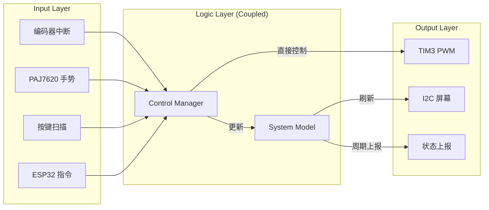
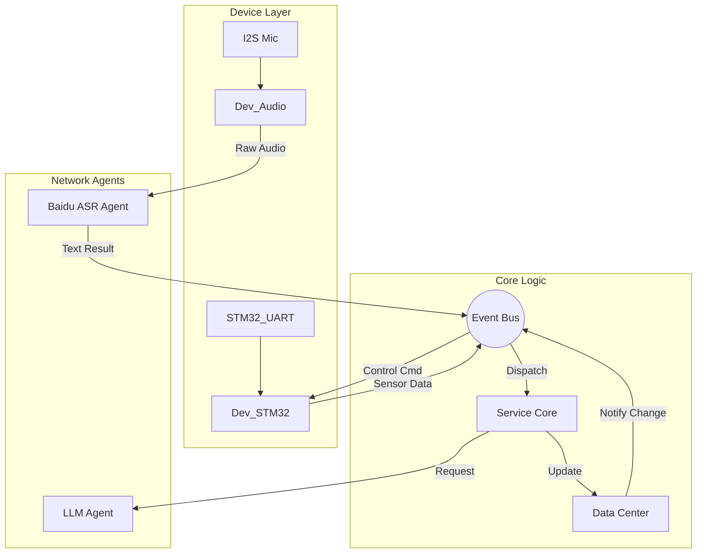
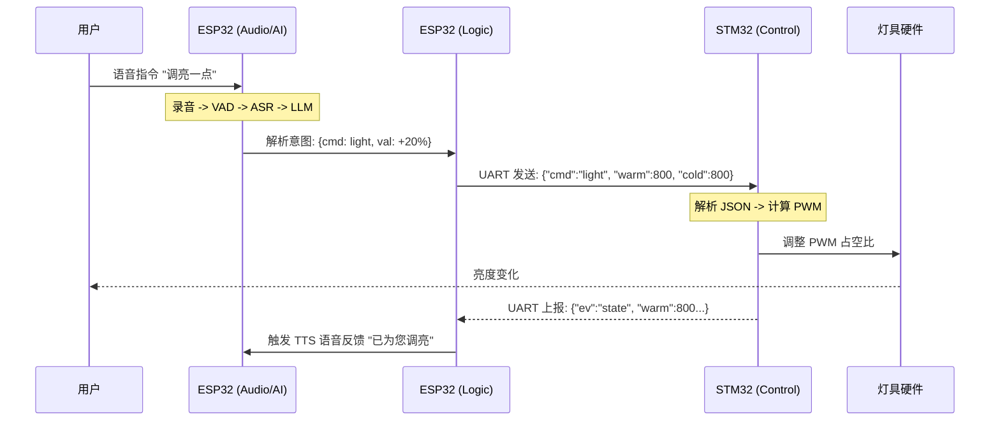

# 基于 STM32 与 ESP32 协同架构的 AI 赋能智能台灯

> **Graduation Project: AI-Powered Smart Lamp based on Dual-Chip Architecture**
>
> **核心特性**: 离线/在线双模控制 | 语音自然交互 | 无极调光 | 手势识别 | 组件化架构

## 📖 项目简介 (Introduction)

本项目是一个探索嵌入式系统“大小脑协同”架构的毕业设计原型。系统采用 **STM32F103C8T6** 作为实时控制协处理器（小脑），负责底层的 PWM 生成、传感器数据采集与手势识别；采用 **ESP32-S3** 作为主控制器（大脑），负责 Wi-Fi 连接、音频流处理、云端大模型（LLM）对接以及系统级业务调度。

本项目旨在验证在资源受限的嵌入式设备上，如何通过合理的架构分层与双核通信，实现低延迟的本地控制与高智能的云端交互的有机结合。

---

## 🏗️ 1. STM32 端结构设计与信息流 (The Cerebellum)

STM32 端固件是项目早期的开发成果。其核心职责是确保硬件控制的**实时性**与**稳定性**。

### 1.1 架构现状与反思
*   **设计模式**: 采用了经典的“前后台系统”设计（中断 + 主循环）。
*   **模块划分**:
    *   `Hardware/`: 封装了底层外设驱动（GPIO, PWM, I2C, UART_DMA）。
    *   `App/`: 包含了业务逻辑（ControlManager, SensorHub）。
*   **架构反思 (Legacy Design)**:
    由于早期开发阶段对系统复杂度的预估不足，STM32 端代码存在**层间耦合较深**的问题。例如，`ControlManager`（业务层）直接调用了 `LED_SetPWM`（驱动层），缺乏中间的硬件抽象层（HAL）或事件总线机制。虽然代码运行稳定且实时性极高，但在扩展性和可维护性上不如后期的 ESP32 端设计。

### 1.2 信息流向 (Information Flow)

STM32 内部的数据流主要由**中断事件**驱动，直接触发控制逻辑。

---

## 🧠 2. ESP32-S3 端架构设计与信息流 (The Brain)

ESP32-S3 端固件在项目后期开发，吸取了 STM32 开发过程中的经验，采用了更加现代化的**组件化（Component-based）**与**事件驱动（Event-Driven）**架构。

### 2.1 架构亮点
*   **高内聚低耦合**: 基于 ESP-IDF 组件规范，将业务逻辑 (`3_Service`)、硬件驱动 (`2_Device`) 和数据模型 (`1_DataRepo`) 物理分离。
*   **单一真理源 (Single Source of Truth)**: 引入 `DataCenter` 模块，所有业务状态（灯光、天气、系统状态）统一管理，杜绝了状态同步冲突。
*   **事件总线 (EventBus)**: 模块间通信不再通过函数直调，而是通过发布/订阅事件（`EVT_KEY_CLICK`, `EVT_ASR_RESULT` 等）进行解耦。

### 2.2 信息流向 (Information Flow)

ESP32 内部采用了复杂的异步处理流，特别是音频与网络任务。

---

## 🔄 3. 双端整体协同信息流 (System Integration)

当用户发起语音指令（例如：“把灯光调亮一点”）时，双端协同工作的完整链路如下：

---

## ⚠️ 4. 缺陷说明与局限性 (Known Issues)

本项目作为原型验证系统，目前尚存在以下已知缺陷和待改进项：

### 4.1 通信可靠性 (Communication)
*   **缺乏校验**: 目前 STM32 与 ESP32 之间的 UART 通信仅基于 JSON 字符串，未实现 CRC 校验或 Checksum，在强干扰环境下可能出现丢包或解析错误。
*   **无重传机制**: 通信层未设计 ACK 应答与超时重传机制，指令下发属于“射后不理”模式。

### 4.2 音频交互延迟 (Latency)
*   **高延迟**: 目前从用户说完指令到灯光执行，平均延迟约为 **10秒**。
    *   *原因分析*: 录音缓冲（VAD判定）、HTTP 握手建立、云端 ASR 识别、LLM 推理以及 TTS 生成均为串行阻塞式处理，且未做流式优化。

### 4.3 代码可移植性 (Portability)
*   **STM32 端**: 部分 GPIO 操作直接操作寄存器或依赖特定标准库，未完全抽象为 HAL 层接口，移植到其他 MCU 平台难度较大。

### 4.4 功能缺失 (Missing Features)
*   **UI 显示**: ESP32-S3 端的 LVGL 图形界面驱动尚未集成，目前仅依靠 STM32 端的 OLED 进行简单的参数显示。

---

## 📚 文档索引 (Documentation)

更多详细的技术细节，请参阅 `docs/` 目录下的文档：

*   [01_System_Overview.md](docs/01_System_Overview.md): 双端通信协议规范与系统综述。
*   [02_ESP32_Design.md](docs/02_ESP32_Design.md): ESP32 固件架构详解（组件、任务、状态机）。
*   [03_STM32_Design.md](docs/03_STM32_Design.md): STM32 固件逻辑与设计反思。
*   [04_Hardware_Wiring.md](docs/04_Hardware_Wiring.md): 硬件引脚分配与接线图。
*   [05_Issues_Roadmap.md](docs/05_Issues_Roadmap.md): 问题追踪与后续开发路线图。